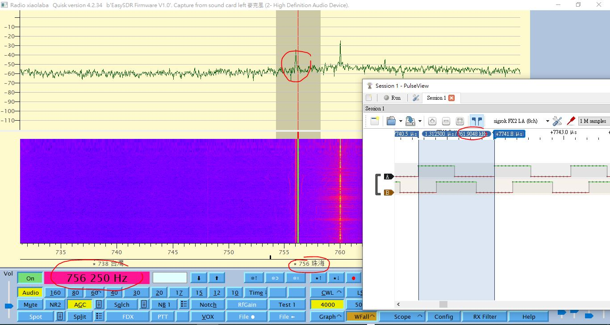

# ESP32_quisk_SDR_testing
AM收音機, 不是用來聽廣播節目, 只玩它的接收原理加深認識, 所謂SDR, 就是軟件定義無線電. 這個實驗純粹收音機, 不需要執照不含發射, 這種收音機不需要 LC TANK.   

都是抄來的, 不需要自己發明輪子, 但是有些地方因為手邊有些小問題或者零件不同, 小改動  
clone these,  
https://github.com/michalin/easysdr  
https://www.youtube.com/watch?v=HCDi5qV1cmU  

modified code to flashing LED, used different analog swith and OPA.  


### 準備, 硬體
ESP32, 純粹產生震盪頻率, 另外還需要跟 PC 端的 QUISK 溝通, 設定頻率  
CD4051, 旋轉開關, 把無線電訊號一個週期分成四等份, 送到運放 MC4558   
MC4558, 雙運算放大器, 連結成兩個差分放大器, 輸出兩個訊號 I 和 Q  
PC, 運行 QUISK 軟體, 要有 MIC-IN / LINE-IN, 一般 2011 年以後的 PC 都是標配  
一根10米的幼電線, 用報廢馬達拆的漆包線也可以, 拖到室外當作天線

  

### 需要的準備, 軟體 / OS
Win10 / home / pro.  
python, for Windows installer (64-bit), https://www.python.org/ftp/python/3.11.9/python-3.11.9-amd64.exe  
quisk, 作者網站有教學 [https://james.ahlstrom.name/quisk/](https://james.ahlstrom.name/quisk/docs.html#Installation)  

### 安裝軟體
python-3.11.9-amd64.exe, 執行安裝, 全部內定選項, 不改免麻煩.  
安裝完畢, 執行 CMD, 打開一個 DOSBOX, 再來安裝 quisk, 以下指令
```
python -m pip install --upgrade pip
python -m pip install --upgrade setuptools
python -m pip install --upgrade wxPython
python -m pip install --upgrade pyserial
python -m pip install --upgrade quisk 
```


### 設定軟體 quisk
下載 xiao_quisk_conf.py, 通常它會自動安裝到 %userprofile%\Documents, 不行就自行複製.  
看看 ESP32 插入PC 後顯示的的 COM PORT 號碼, 例如是, COM6, 修改 xiao_quisk_conf.py 第29行, 改成 COM6
```
# Sound card and serial port settings depending on OS
#
sample_rate = 96000					# name_of_sound_capt hardware sample rate in Hertz
openradio_serial_rate = 115200

if sys.platform == "win32":
  name_of_sound_capt = "Primary"
  name_of_sound_play = "Primary"
  openradio_serial_port = "COM6"
```

 


### 燒綠 ESP32 與搭棚
燒寫後板上的 藍色 LED 應該會閃爍, 表示正常可以接收 quisk 傳來的指令  
搭建簡單電路的步驟不寫, 就是手工藝品加上麵包板即可. IQ 訊號經過 3.5mm 耳機插頭, 插入 PC 的 MIC-IN 或者 LINE-IN, 接上天線, 可以開始聽聽這個簡化版的 SDR, 主要是聽 AM756, 調幅廣播, 頻率756KHz, 中國之聲, 因為各地的強電台可能不同頻率, 找不到 AM756, 可以自行搜尋一下wiki或者百度.  

### 啟動這個 AM 收音機
仍然在 DOSBOX 裡面, 輸入指令, 
```
python -m quisk
```

如果看不到任何畫面或者報錯, 大概 OS 不是純英文版, 例如一台 PC WIN10 64bit Pro, 台灣版 CODE PAGE 950, 報錯 [UnicodeDecoderError cp950](#unicodedecodererror-cp950), 解決方法看下面.  

### 設定 SDR
看到 quisk 的畫面後, 可以 config, 加入一個 RADIO, 改個自己愛好的名字.  
點選它, 指定 IQ config 的資料檔, 例如 %userprofile%\Documents\xiao_quisk_conf.py  
關閉 quisk 然後再次運行, 輸入頻率 756000 然後按 ENTER, 應該就可以開始聽 AM7560.
  
  
  
  

### UnicodeDecoderError cp950
原作者可能漏掉, 有些 open file 的操作省略了 encoding="utf8", %userprofile%\Documents 這等非英文OS的路徑操作失敗, 就會無法執行 quisk.  
有向原作者反映, 用 pip 安裝的 quisk, 要自行修改兩個 py 檔, 如下.
github 的原始碼4.2.35則有一個 quisk.py 檔已經改過, 剩下一個 configure.py 還是沒改, 原作者說下一版會修好, pull request 關閉.  
叉回來, 改過 https://github.com/xiaolaba/quisk, 參考而已.  

```
configure.py, line 604
fp = open(filename, "r", encoding="utf-8")

quisk.py, line 91
self.fp = open(self.path, "a", buffering=1, encoding='utf-8', errors='replace', newline=None)
```


###
